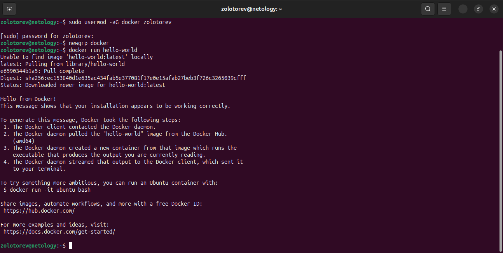

# Домашнее задание к занятию «Docker. Часть 1»
### Золоторев Н.Д.

### Задание 1

1. Установите Docker.
2. Выполните: инструкцию linux post install
3. Запустите образ hello-world без использования sudo(см п2).
4. Удалите ваш контейнер с hello-world.

### Решение 1

### Задание 2

1. Найдите в Docker Hub образ Apache(httpd) и запустите его на 80 порту вашей ВМ.
2. Откройте страницу http://localhost и убедитесь, что видите приветвенную страницу Apache.

### Решение 2

### Задание 3

1. Создайте свой Docker образ с Apache и подмените стандартную страницу index.html на страницу, содержащую ваши ФИО.
2. Запустите ваш образ, откройте страницу http://localhost и убедитесь, что страница изменилась.

### Решение 3

